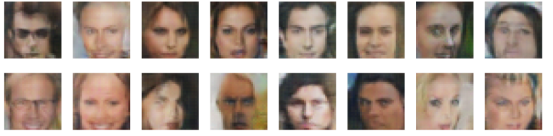

# Face Generator using Sagemaker

This repo has the Pytorch implementation of Facegeneration using AWS Sagemaker. Faces are generated using DCGAN architecure. It was trained on a [Celebrities](https://www.kaggle.com/greg115/celebrities-100k) dataset.

To follow along, please check the Medium article: [Train a GAN and generate faces using AWS Sagemaker | PyTorch](https://towardsdatascience.com/face-generator-generating-artificial-faces-with-machine-learning-9e8c3d6c1ead).

## DCGAN Architecture

## Results

Results after Training some epochs

## Author

**Shyam BV**

[**GITHUB**](https://github.com/bvshyam)

[**BLOG**](https://medium.com/@bv.shyam)

